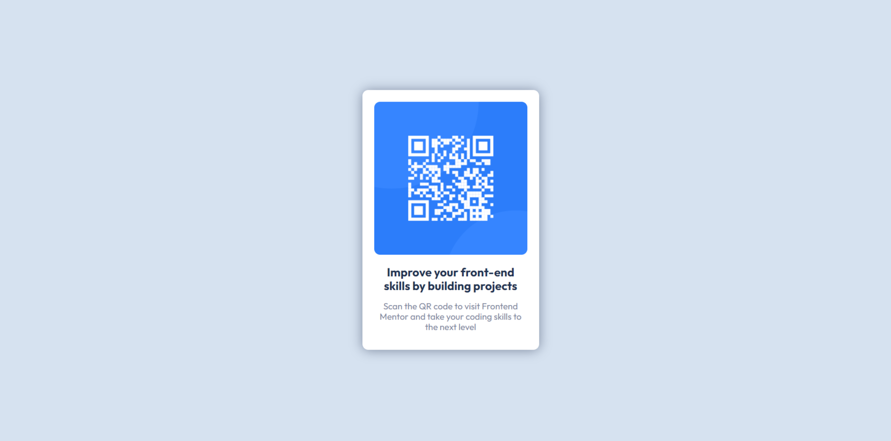

# QR-Code-Component

This is a challenge from Frontend Mentor

### Screenshot

### Links

Live Site URL: [https://al-ateek.github.io/HTML-CSS-Template-Two/]
Challenge URL: [https://www.graphberry.com/item/kasper-one-page-psd-template]

### built with

- Normal CSS elements
- CSS custom properties
- Flexbox

### Useful resources

- [Frontend Mentor] - (https://elzero.org/) - Improve your Front-End skills my building projects
